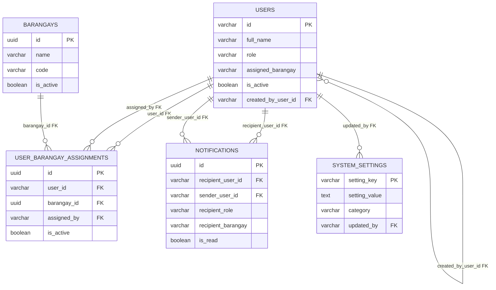
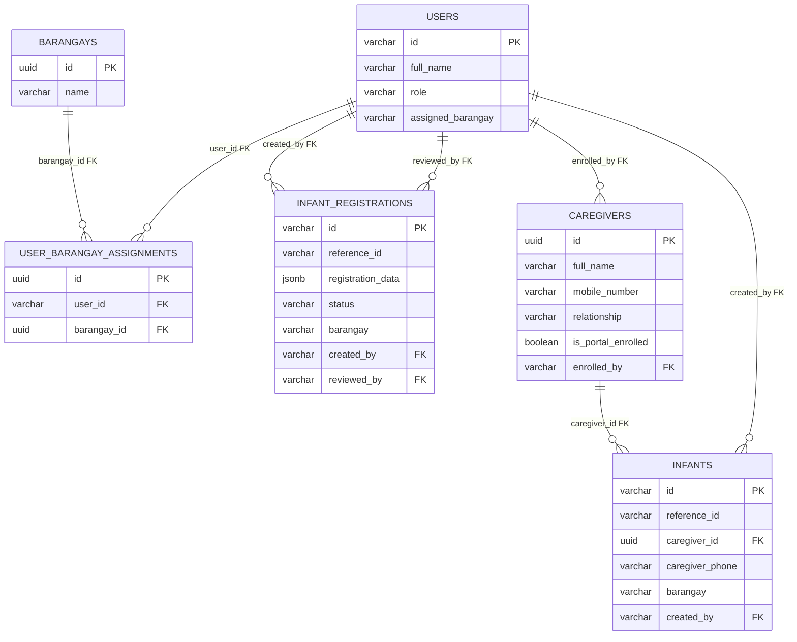
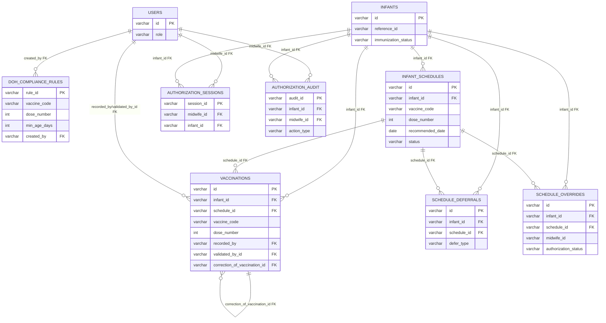
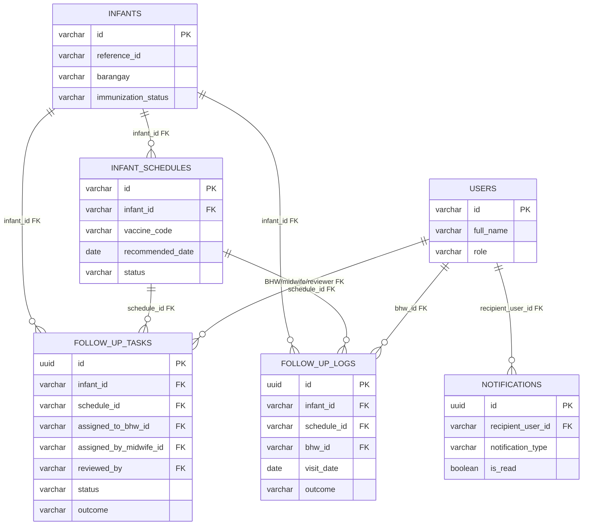
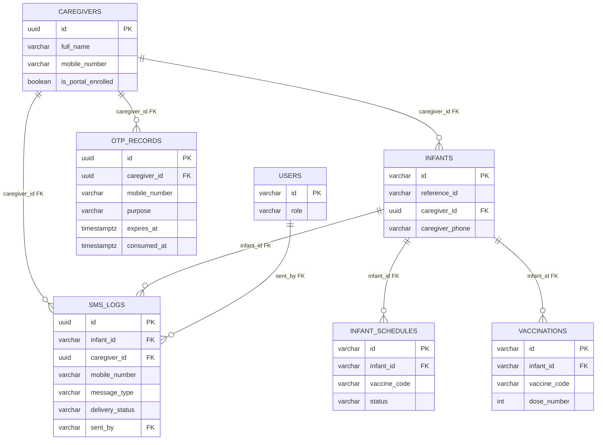
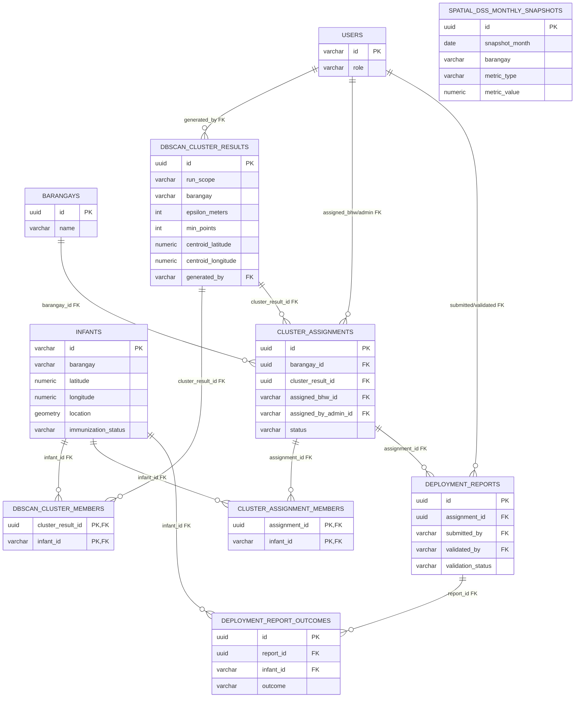

# IMMUNICARE Database Modular ERD Documentation Draft

Source of truth inspected: live PostgreSQL database, `server/scripts/rebuild_schema.sql`, and PostgreSQL migrations under `server/migrations`. Historical MySQL dumps and MySQL migration scripts exist, but the running application uses PostgreSQL through `server/db.js`.

## 10. Overall Database Structure Summary

IMMUNICARE currently has 37 application tables in the public PostgreSQL schema. PostGIS also creates system objects such as `spatial_ref_sys`, `geometry_columns`, and `geography_columns`; these are extension-managed spatial metadata and are not treated as IMMUNICARE business tables.

The complete schema is large because it covers personnel access, barangay assignment, infant registration, validation workflow, master infant records, NIP schedules, vaccination recording, follow-up work, SMS/OTP access, DBSCAN hotspot detection, deployment reporting, M1 reporting, audit logging, settings, and backup tracking. For the capstone paper, present the full ERD as a high-level overview, then present the modular ERDs below for readability and defense discussion.

Important documentation note: some relationships are enforced by PostgreSQL foreign keys, while others are only logical relationships through text fields such as `barangay`, `assigned_barangay`, `recipient_barangay`, or generic audit target fields. These are clearly labeled below.

## 11. Recommended Modular ERD Sections

1. Authentication, RBAC, and Personnel Management
2. Infant Registration and Caregiver Profiling
3. Registration Validation and Master Infant Registry
4. NIP Schedule and Vaccination Recording
5. Defaulter Tracking and Follow-Up Management
6. SMS Reminder and OTP Caregiver Access
7. DBSCAN and Geospatial Hotspot Monitoring
8. Reports, Audit Trail, and Backup/Recovery

## 12. Modular ERD 1 - Authentication, RBAC, and Personnel Management

Suggested figure title: Figure 3.X. Authentication, RBAC, and Personnel Management ERD

Caption: This ERD shows how IMMUNICARE stores staff/caregiver user accounts, role assignment through the `users.role` field, barangay master data, and multi-barangay user assignment records.

Included tables: `users`, `barangays`, `user_barangay_assignments`, `notifications`, `system_settings`

Module explanation: This module manages user identities, account status, role-based access values, barangay assignment, and user-targeted notifications/settings. There are no separate `roles`, `permissions`, `role_permissions`, or `user_roles` tables in the inspected schema. RBAC is implemented through the `users.role` column and application logic.

Relationship explanation:
- `users.created_by_user_id -> users.id` is enforced by foreign key.
- `user_barangay_assignments.user_id -> users.id`, `barangay_id -> barangays.id`, and `assigned_by -> users.id` are enforced by foreign key.
- `notifications.recipient_user_id -> users.id` and `notifications.sender_user_id -> users.id` are enforced by foreign key.
- `system_settings.updated_by -> users.id` is enforced by foreign key.
- `users.assigned_barangay` is a logical relationship to `barangays.name`; foreign key not enforced.

## 13. Modular ERD 2 - Infant Registration and Caregiver Profiling

Suggested figure title: Figure 3.X. Infant Registration and Caregiver Profiling ERD

Caption: This ERD presents the intake side of IMMUNICARE, including draft/pending infant registrations, caregiver profiles, BHW or staff encoders, and barangay assignment references.

Included tables: `infant_registrations`, `caregivers`, `infants`, `users`, `barangays`, `user_barangay_assignments`

Module explanation: Draft and submitted infant registrations are stored in `infant_registrations`. The submitted clinical/demographic payload is held in `registration_data` JSONB. Caregiver master records are stored separately in `caregivers`, and approved infants can point to a caregiver using `infants.caregiver_id`.

Relationship explanation:
- `infant_registrations.created_by -> users.id` is enforced by foreign key and represents the user/BHW/staff who created or submitted the registration.
- `infant_registrations.reviewed_by -> users.id` is enforced by foreign key.
- `infants.caregiver_id -> caregivers.id` is enforced by foreign key.
- `caregivers.enrolled_by -> users.id` is enforced by foreign key.
- `infant_registrations.barangay` and `infants.barangay` are logical relationships to `barangays.name`; foreign key not enforced.
- Caregiver details inside `infant_registrations.registration_data` are logical only; foreign key not enforced until a record is promoted/linked through `infants.caregiver_id`.

## 14. Modular ERD 3 - Registration Validation and Master Infant Registry

Suggested figure title: Figure 3.X. Registration Validation and Master Infant Registry ERD

Caption: This ERD shows the workflow from submitted infant registration to validation event, approval audit, and approved master infant record.

Included tables: `infant_registrations`, `registration_validation_events`, `infants`, `approval_audit`, `audit_trail`, `users`

Migration-defined table needing live verification: `infant_transfer_events` exists in `server/migrations/20260607_create_infant_transfer_events.sql`, but it was not present in the inspected live PostgreSQL table list.

Module explanation: This module documents the Draft -> Pending Validation -> Approved / Needs Correction / Rejected workflow. `infant_registrations.status` stores the workflow state. Approved registrations can be linked to a promoted master infant record through both `infant_registrations.promoted_infant_id` and `infants.approved_registration_id`.

Relationship explanation:
- `registration_validation_events.registration_id -> infant_registrations.id` is enforced by foreign key.
- `registration_validation_events.reviewer_user_id -> users.id` is enforced by foreign key.
- `infant_registrations.promoted_infant_id -> infants.id` is enforced by foreign key.
- `infants.approved_registration_id -> infant_registrations.id` is enforced by foreign key.
- `approval_audit.registration_id -> infant_registrations.id` and `approval_audit.infant_id -> infants.id` are enforced by foreign key.
- `approval_audit.approver_id` is logical relationship only; foreign key not enforced.
- `audit_trail.user_id` and `audit_trail.entity_id` are logical relationships only; foreign keys not enforced.
- `infant_transfer_events`, if migration-applied, would enforce `infant_id -> infants.id` and `transferred_by -> users.id`; needs verification in the deployed database.

```mermaid
erDiagram
    USERS {
        varchar id PK
        varchar full_name
        varchar role
    }
    INFANT_REGISTRATIONS {
        varchar id PK
        varchar reference_id
        varchar status
        varchar created_by FK
        varchar reviewed_by FK
        varchar promoted_infant_id FK
    }
    REGISTRATION_VALIDATION_EVENTS {
        uuid id PK
        varchar registration_id FK
        varchar event_type
        varchar reviewer_user_id FK
    }
    INFANTS {
        varchar id PK
        varchar reference_id
        varchar registration_status
        varchar approved_registration_id FK
        varchar status
    }
    APPROVAL_AUDIT {
        varchar id PK
        varchar registration_id FK
        varchar infant_id FK
        varchar action
        varchar approver_id
    }
    AUDIT_TRAIL {
        varchar id PK
        varchar entity_type
        varchar entity_id
        varchar user_id
        varchar action_type
    }

    USERS ||--o{ INFANT_REGISTRATIONS : "created_by/reviewed_by FK"
    INFANT_REGISTRATIONS ||--o{ REGISTRATION_VALIDATION_EVENTS : "registration_id FK"
    USERS ||--o{ REGISTRATION_VALIDATION_EVENTS : "reviewer_user_id FK"
    INFANT_REGISTRATIONS ||--o| INFANTS : "promoted_infant_id FK"
    INFANT_REGISTRATIONS ||--o{ INFANTS : "approved_registration_id FK"
    INFANT_REGISTRATIONS ||--o{ APPROVAL_AUDIT : "registration_id FK"
    INFANTS ||--o{ APPROVAL_AUDIT : "infant_id FK"
```

## 15. Modular ERD 4 - NIP Schedule and Vaccination Recording

Suggested figure title: Figure 3.X. NIP Schedule and Vaccination Recording ERD

Caption: This ERD shows NIP rules, generated infant schedules, recorded vaccination doses, clinical deferrals, overrides, and authorization audit records.

Included tables: `doh_compliance_rules`, `infant_schedules`, `vaccinations`, `schedule_deferrals`, `schedule_overrides`, `authorization_sessions`, `authorization_audit`, `infants`, `users`

Module explanation: NIP rules are stored in `doh_compliance_rules`. Infant-level schedule rows are stored in `infant_schedules`. Actual immunization events are stored in `vaccinations`, including dose corrections through a self-referencing foreign key.

Relationship explanation:
- `infant_schedules.infant_id -> infants.id` is enforced by foreign key.
- `vaccinations.infant_id -> infants.id`, `schedule_id -> infant_schedules.id`, `recorded_by -> users.id`, `validated_by_id -> users.id`, and `correction_of_vaccination_id -> vaccinations.id` are enforced by foreign key.
- `schedule_deferrals.infant_id -> infants.id` and `schedule_id -> infant_schedules.id` are enforced by foreign key.
- `schedule_overrides.infant_id -> infants.id` and `schedule_id -> infant_schedules.id` are enforced by foreign key.
- `authorization_sessions.midwife_id -> users.id` and `infant_id -> infants.id` are enforced by foreign key.
- `authorization_audit.midwife_id -> users.id` and `infant_id -> infants.id` are enforced by foreign key.
- `doh_compliance_rules.created_by -> users.id` is enforced by foreign key.
- `infant_schedules.vaccine_code` and `vaccinations.vaccine_code` logically correspond to `doh_compliance_rules.vaccine_code`; foreign key not enforced.
- `schedule_overrides.midwife_id` and `schedule_deferrals.deferred_by` are logical relationships to `users.id`; foreign keys not enforced.

## 16. Modular ERD 5 - Defaulter Tracking and Follow-Up Management

Suggested figure title: Figure 3.X. Defaulter Tracking and Follow-Up Management ERD

Caption: This ERD shows how overdue/defaulting schedules are associated with follow-up tasks, BHW worklists, visit logs, and midwife review.

Included tables: `infants`, `infant_schedules`, `follow_up_tasks`, `follow_up_logs`, `users`, `notifications`

Module explanation: Defaulter tracking is derived mainly from `infant_schedules.status` and `infants.immunization_status`. Follow-up tasks assign BHWs to defaulting infants and optionally reference the relevant schedule. Follow-up logs record actual visits or contact outcomes.

Relationship explanation:
- `follow_up_tasks.infant_id -> infants.id`, `schedule_id -> infant_schedules.id`, `assigned_to_bhw_id -> users.id`, `assigned_by_midwife_id -> users.id`, and `reviewed_by -> users.id` are enforced by foreign key.
- `follow_up_logs.infant_id -> infants.id`, `schedule_id -> infant_schedules.id`, and `bhw_id -> users.id` are enforced by foreign key.
- `notifications.recipient_user_id -> users.id` is enforced by foreign key and can be used for BHW or midwife task notifications.
- `follow_up_tasks.barangay`, `follow_up_logs.barangay`, and `notifications.recipient_barangay` are logical relationships to `barangays.name`; foreign key not enforced.

## 17. Modular ERD 6 - SMS Reminder and OTP Caregiver Access

Suggested figure title: Figure 3.X. SMS Reminder and OTP Caregiver Access ERD

Caption: This ERD shows caregiver contact records, SMS reminder/OTP logs, OTP authentication records, and caregiver access to infant immunization card data.

Included tables: `caregivers`, `infants`, `sms_logs`, `otp_records`, `users`, `infant_schedules`, `vaccinations`

Module explanation: Caregiver portal access is supported by caregiver profiles and OTP records. SMS reminders are tracked in `sms_logs` and may reference either a caregiver, an infant, or the staff user who sent the message. Digital immunization card access is assembled from `infants`, `infant_schedules`, and `vaccinations`.

Relationship explanation:
- `infants.caregiver_id -> caregivers.id` is enforced by foreign key.
- `sms_logs.caregiver_id -> caregivers.id`, `infant_id -> infants.id`, and `sent_by -> users.id` are enforced by foreign key.
- `otp_records.caregiver_id -> caregivers.id` is enforced by foreign key.
- `infant_schedules.infant_id -> infants.id` and `vaccinations.infant_id -> infants.id` are enforced by foreign key.
- `otp_records.mobile_number` logically corresponds to `caregivers.mobile_number`; foreign key not enforced.
- `infants.caregiver_phone` logically corresponds to caregiver contact numbers; foreign key not enforced.

## 18. Modular ERD 7 - DBSCAN and Geospatial Hotspot Monitoring

Suggested figure title: Figure 3.X. DBSCAN and Geospatial Hotspot Monitoring ERD

Caption: This ERD shows the geospatial data used to compute DBSCAN hotspot clusters, cluster membership, BHW cluster assignments, deployment reports, and monthly spatial DSS snapshots.

Included tables: `infants`, `barangays`, `dbscan_cluster_results`, `dbscan_cluster_members`, `cluster_assignments`, `cluster_assignment_members`, `deployment_reports`, `deployment_report_outcomes`, `spatial_dss_monthly_snapshots`, `users`

Module explanation: Infant coordinates are stored in `infants.latitude`, `infants.longitude`, and `infants.location` geometry. DBSCAN run outputs are stored in `dbscan_cluster_results`; cluster membership is represented by the junction table `dbscan_cluster_members`. Hotspot work assignment is tracked in `cluster_assignments` and `cluster_assignment_members`.

Relationship explanation:
- `dbscan_cluster_members.cluster_result_id -> dbscan_cluster_results.id` and `infant_id -> infants.id` are enforced by foreign key. This is a many-to-many relationship between cluster results and infants.
- `dbscan_cluster_results.generated_by -> users.id` is enforced by foreign key.
- `cluster_assignments.barangay_id -> barangays.id`, `cluster_result_id -> dbscan_cluster_results.id`, `assigned_bhw_id -> users.id`, and `assigned_by_admin_id -> users.id` are enforced by foreign key.
- `cluster_assignment_members.assignment_id -> cluster_assignments.id` and `infant_id -> infants.id` are enforced by foreign key. This is a many-to-many relationship between assignments and infants.
- `deployment_reports.assignment_id -> cluster_assignments.id`, `submitted_by -> users.id`, and `validated_by -> users.id` are enforced by foreign key.
- `deployment_report_outcomes.report_id -> deployment_reports.id` and `infant_id -> infants.id` are enforced by foreign key.
- `infants.barangay`, `dbscan_cluster_results.barangay`, `cluster_assignments.barangay`, `deployment_reports.barangay`, and `spatial_dss_monthly_snapshots.barangay` are logical relationships to `barangays.name`; foreign key not enforced.
- DBSCAN is connected to infants through `dbscan_cluster_members`, but the barangay string fields are not fully normalized/enforced. This should be explained as a documentation limitation and possible future hardening item.

## 19. Modular ERD 8 - Reports, Audit Trail, and Backup/Recovery

Suggested figure title: Figure 3.X. Reports, Audit Trail, and Backup/Recovery ERD

Caption: This ERD presents report export tracking, M1 target/reporting data, audit logs, security/governance logs, system settings, and backup run history.

Included tables: `report_exports`, `backup_runs`, `audit_logs`, `audit_trail`, `system_audit_logs`, `system_settings`, `m1_immunization_targets`, `m1_monthly_actual_populations`, `m1_municipal_targets`, `m1_doh_monitoring_data`, `spatial_dss_monthly_snapshots`, `barangays`, `users`

Module explanation: This module stores administrative evidence for reports, backups, settings changes, and auditability. M1 reporting tables support immunization target configuration and imported DOH monitoring data.

Relationship explanation:
- `report_exports.generated_by -> users.id` is enforced by foreign key.
- `backup_runs.initiated_by -> users.id` is enforced by foreign key.
- `audit_logs.actor_user_id -> users.id` and `audit_logs.barangay_id -> barangays.id` are enforced by foreign key.
- `system_audit_logs.user_id -> users.id` is enforced by foreign key.
- `system_settings.updated_by -> users.id` is enforced by foreign key.
- `m1_immunization_targets.barangay_id -> barangays.id`, `created_by -> users.id`, and `updated_by -> users.id` are enforced by foreign key.
- `m1_monthly_actual_populations.barangay_id -> barangays.id`, `created_by -> users.id`, and `updated_by -> users.id` are enforced by foreign key.
- `m1_municipal_targets.created_by -> users.id` and `updated_by -> users.id` are enforced by foreign key.
- `audit_trail.user_id`, `audit_trail.entity_id`, `system_audit_logs.target_id`, and `audit_logs.target_record_id` are generic audit references; logical relationship only, foreign key not enforced.
- `m1_doh_monitoring_data.barangay` and `spatial_dss_monthly_snapshots.barangay` are logical relationships to `barangays.name`; foreign key not enforced.

```mermaid
erDiagram
    USERS {
        varchar id PK
        varchar full_name
        varchar role
    }
    BARANGAYS {
        uuid id PK
        varchar name
    }
    REPORT_EXPORTS {
        uuid id PK
        varchar report_type
        varchar format
        varchar generated_by FK
    }
    BACKUP_RUNS {
        uuid id PK
        varchar backup_type
        varchar status
        varchar initiated_by FK
    }
    AUDIT_LOGS {
        uuid id PK
        varchar actor_user_id FK
        uuid barangay_id FK
        varchar action
        varchar target_entity
        varchar target_record_id
    }
    AUDIT_TRAIL {
        varchar id PK
        varchar entity_type
        varchar entity_id
        varchar user_id
        varchar action_type
    }
    SYSTEM_AUDIT_LOGS {
        bigserial id PK
        varchar user_id FK
        varchar action_type
        varchar target_entity
        varchar target_id
    }
    SYSTEM_SETTINGS {
        varchar setting_key PK
        text setting_value
        varchar category
        varchar updated_by FK
    }
    M1_IMMUNIZATION_TARGETS {
        uuid id PK
        uuid barangay_id FK
        int report_year
        int total_population
        varchar created_by FK
        varchar updated_by FK
    }
    M1_MONTHLY_ACTUAL_POPULATIONS {
        uuid id PK
        uuid barangay_id FK
        int report_year
        int report_month
        int actual_population
    }
    M1_MUNICIPAL_TARGETS {
        uuid id PK
        int report_year
        varchar municipality_name
        varchar created_by FK
        varchar updated_by FK
    }
    M1_DOH_MONITORING_DATA {
        uuid id PK
        int report_year
        int report_month
        varchar barangay
        varchar chart_type
    }
    SPATIAL_DSS_MONTHLY_SNAPSHOTS {
        uuid id PK
        date snapshot_month
        varchar barangay
        varchar metric_type
    }

    USERS ||--o{ REPORT_EXPORTS : "generated_by FK"
    USERS ||--o{ BACKUP_RUNS : "initiated_by FK"
    USERS ||--o{ AUDIT_LOGS : "actor_user_id FK"
    BARANGAYS ||--o{ AUDIT_LOGS : "barangay_id FK"
    USERS ||--o{ SYSTEM_AUDIT_LOGS : "user_id FK"
    USERS ||--o{ SYSTEM_SETTINGS : "updated_by FK"
    BARANGAYS ||--o{ M1_IMMUNIZATION_TARGETS : "barangay_id FK"
    BARANGAYS ||--o{ M1_MONTHLY_ACTUAL_POPULATIONS : "barangay_id FK"
    USERS ||--o{ M1_IMMUNIZATION_TARGETS : "created/updated FK"
    USERS ||--o{ M1_MONTHLY_ACTUAL_POPULATIONS : "created/updated FK"
    USERS ||--o{ M1_MUNICIPAL_TARGETS : "created/updated FK"
```

## 20. Data Dictionary Draft

| Table name | Purpose | Primary key | Foreign keys | Important fields | Relationship with other tables |
|---|---|---|---|---|---|
| `approval_audit` | Records approval, rejection, or correction audit entries for registrations/infants. | `id` | `registration_id -> infant_registrations.id`, `infant_id -> infants.id` enforced by foreign key. | `action`, `approver_id`, `approver_role`, `remarks`, `timestamp` | Links validation decisions to registration and infant records; `approver_id` is logical only, foreign key not enforced. |
| `audit_logs` | Structured immutable audit log for actor, scope, target, and before/after values. | `id` | `actor_user_id -> users.id`, `barangay_id -> barangays.id` enforced by foreign key. | `actor_role`, `action`, `target_entity`, `target_record_id`, `target_name`, `scope_type`, `old_values`, `new_values`, `metadata` | Actor and barangay are enforced; target record is generic/logical only. |
| `audit_trail` | Clinical/workflow audit trail for entity changes. | `id` | None. | `entity_type`, `entity_id`, `action_type`, `user_id`, `user_role`, `old_values`, `new_values` | Logical links to users/entities only; foreign keys not enforced. |
| `authorization_audit` | Immutable record of clinical schedule override/authorization actions. | `audit_id` | `infant_id -> infants.id`, `midwife_id -> users.id` enforced by foreign key. | `vaccine_name`, `action_type`, `clinical_justification`, `override_type`, `compliance_status`, `is_immutable` | One infant/user can have many authorization audit entries. |
| `authorization_sessions` | Tracks midwife authorization sessions for infants. | `session_id` | `midwife_id -> users.id`, `infant_id -> infants.id` enforced by foreign key. | `session_start`, `session_end`, `ip_address`, `authorization_count` | One midwife and one infant may have many sessions. |
| `backup_runs` | Stores backup/recovery run history. | `id` | `initiated_by -> users.id` enforced by foreign key. | `backup_type`, `status`, `storage_location`, `started_at`, `completed_at`, `error_message` | User-to-backup relationship is enforced. |
| `barangays` | Master list of barangays/locality areas. | `id` | None. | `name`, `code`, `city`, `province`, `is_active` | Referenced by several tables through enforced `barangay_id`; many other tables use barangay names logically only. |
| `caregivers` | Master caregiver profile and portal enrollment record. | `id` | `enrolled_by -> users.id` enforced by foreign key. | `full_name`, `mobile_number`, `relationship`, `is_portal_enrolled`, `enrolled_at` | Linked to infants, SMS logs, OTP records; one caregiver may have many infants. |
| `cluster_assignment_members` | Junction table between hotspot assignments and infants. | Composite: `assignment_id`, `infant_id` | `assignment_id -> cluster_assignments.id`, `infant_id -> infants.id` enforced by foreign key. | `created_at` | Many-to-many assignment-to-infant relationship. |
| `cluster_assignments` | Tracks BHW/admin assignment of DBSCAN cluster areas. | `id` | `barangay_id -> barangays.id`, `cluster_result_id -> dbscan_cluster_results.id`, `assigned_bhw_id -> users.id`, `assigned_by_admin_id -> users.id` enforced by foreign key. | `barangay`, `cluster_area_key`, `cluster_label`, `centroid_latitude`, `centroid_longitude`, `status` | Connects DBSCAN result to assigned personnel and member infants. |
| `dbscan_cluster_members` | Junction table between DBSCAN cluster results and infants. | Composite: `cluster_result_id`, `infant_id` | `cluster_result_id -> dbscan_cluster_results.id`, `infant_id -> infants.id` enforced by foreign key. | Composite key only. | Many-to-many DBSCAN cluster-to-infant relationship. |
| `dbscan_cluster_results` | Stores DBSCAN run output and hotspot centroid values. | `id` | `generated_by -> users.id` enforced by foreign key. | `run_scope`, `barangay`, `epsilon_meters`, `min_points`, `cluster_identifier`, `infant_count`, `centroid_latitude`, `centroid_longitude`, `density_score` | Linked to members and assignments; `barangay` is logical only. |
| `deployment_report_outcomes` | Infant-level outcomes from hotspot deployment reports. | `id` | `report_id -> deployment_reports.id`, `infant_id -> infants.id` enforced by foreign key. | `outcome`, `notes`, `created_at` | One deployment report has many infant outcomes. |
| `deployment_reports` | Summary reports for cluster/hotspot BHW deployments. | `id` | `assignment_id -> cluster_assignments.id`, `submitted_by -> users.id`, `validated_by -> users.id` enforced by foreign key. | `validation_status`, `validation_notes`, `barangay`, totals, `summary_notes` | Belongs to one cluster assignment; may have many outcomes. |
| `doh_compliance_rules` | NIP vaccine timing and compliance rules. | `rule_id` | `created_by -> users.id` enforced by foreign key. | `vaccine_code`, `vaccine_name`, `dose_number`, `min_age_days`, `max_age_days`, `min_interval_days`, `catch_up_rule` | Schedule/vaccination vaccine codes logically correspond; foreign key not enforced. |
| `follow_up_logs` | Visit/contact logs for defaulter follow-up. | `id` | `infant_id -> infants.id`, `schedule_id -> infant_schedules.id`, `bhw_id -> users.id` enforced by foreign key. | `barangay`, `visit_date`, `parent_contact`, `outcome`, `notes` | Records BHW follow-up activity for infants/schedules. |
| `follow_up_tasks` | BHW worklist tasks for overdue/defaulting infants. | `id` | `infant_id -> infants.id`, `schedule_id -> infant_schedules.id`, `assigned_to_bhw_id -> users.id`, `assigned_by_midwife_id -> users.id`, `reviewed_by -> users.id` enforced by foreign key. | `barangay`, `target_completion_date`, `status`, `outcome`, timestamps | Connects infant/schedule to BHW assignment and midwife review. |
| `infant_registrations` | Draft/submitted infant registration workflow records. | `id` | `created_by -> users.id`, `reviewed_by -> users.id`, `promoted_infant_id -> infants.id` enforced by foreign key. | `reference_id`, `registration_data`, `status`, `barangay`, `submitted_at`, correction/rejection fields, `review_history` | Source record for validation and promotion; `barangay` is logical only. |
| `infant_schedules` | Per-infant generated NIP schedule rows. | `id` | `infant_id -> infants.id` enforced by foreign key. | `vaccine_code`, `vaccine_name`, `dose_number`, dates, `status` | One infant has many schedule rows; linked to vaccinations, deferrals, overrides, follow-up. |
| `infants` | Approved master infant registry. | `id` | `caregiver_id -> caregivers.id`, `created_by -> users.id`, `approved_registration_id -> infant_registrations.id` enforced by foreign key. | identity, caregiver contact, birth data, barangay/address, coordinates, vaccine birth statuses, `registration_status`, `immunization_status`, archive fields | Central table referenced by schedules, vaccinations, follow-ups, SMS, DBSCAN, audits, and reports. |
| `infant_transfer_events` | Records barangay/address transfer history for infants. Needs verification: found in migration file, not in inspected live table list. | `id` if migration-applied | `infant_id -> infants.id`, `transferred_by -> users.id` would be enforced by foreign key if migration-applied. | `from_barangay`, `to_barangay`, `reason`, previous/new address/locality, `created_at` | Transfer barangay names are logical only; table presence needs live deployment verification. |
| `m1_doh_monitoring_data` | Imported DOH M1 monitoring chart rows. | `id` | None. | `report_year`, `report_month`, `scope_type`, `barangay`, `chart_type`, counts, dropout fields, source fields | `barangay` is logical relationship only; foreign key not enforced. |
| `m1_immunization_targets` | Barangay-level annual immunization target configuration. | `id` | `barangay_id -> barangays.id`, `created_by -> users.id`, `updated_by -> users.id` enforced by foreign key. | `report_year`, population/eligible population fields, monthly/cumulative targets, `ep_percent` | One barangay can have one target per year. |
| `m1_monthly_actual_populations` | Barangay-level monthly actual population values. | `id` | `barangay_id -> barangays.id`, `created_by -> users.id`, `updated_by -> users.id` enforced by foreign key. | `report_year`, `report_month`, `actual_population` | One barangay can have one monthly actual population per period. |
| `m1_municipal_targets` | Municipality-level annual population targets. | `id` | `created_by -> users.id`, `updated_by -> users.id` enforced by foreign key. | `report_year`, `municipality_name`, `total_population` | Municipality target not tied to barangay table. |
| `notifications` | In-app notifications for users and roles. | `id` | `recipient_user_id -> users.id`, `sender_user_id -> users.id` enforced by foreign key. | `recipient_role`, `recipient_barangay`, `notification_type`, `title`, `message`, `payload`, `is_read`, `action_type` | User references enforced; recipient barangay is logical only. |
| `otp_records` | OTP authentication records for caregiver access. | `id` | `caregiver_id -> caregivers.id` enforced by foreign key. | `mobile_number`, `otp_hash`, `purpose`, `expires_at`, `consumed_at`, `attempt_count` | Linked to caregiver; mobile number also logical contact reference. |
| `registration_validation_events` | Event log for registration review decisions. | `id` | `registration_id -> infant_registrations.id`, `reviewer_user_id -> users.id` enforced by foreign key. | `event_type`, `reason`, `notes`, `metadata`, `created_at` | One registration may have many validation events. |
| `report_exports` | Tracks generated PDF/CSV reports. | `id` | `generated_by -> users.id` enforced by foreign key. | `report_type`, `format`, `filter_params`, `generated_by_role`, `file_path`, `generated_at` | User-to-report export relationship is enforced. |
| `schedule_deferrals` | Records reschedules, contraindications, and temporary deferrals. | `id` | `infant_id -> infants.id`, `schedule_id -> infant_schedules.id` enforced by foreign key. | `vaccine_name`, `original_due_date`, `new_due_date`, `defer_type`, `reason`, `deferred_by` | `deferred_by` is logical relationship only; foreign key not enforced. |
| `schedule_overrides` | Stores clinical override requests/statuses for schedules. | `id` | `infant_id -> infants.id`, `schedule_id -> infant_schedules.id` enforced by foreign key. | `vaccine_name`, `original_due_date`, `new_due_date`, `clinical_reason`, `midwife_id`, `authorization_status`, `compliance_metadata` | `midwife_id` is logical relationship only; foreign key not enforced. |
| `sms_logs` | Tracks outgoing SMS reminders, OTP messages, and manual texts. | `id` | `infant_id -> infants.id`, `caregiver_id -> caregivers.id`, `sent_by -> users.id` enforced by foreign key. | `mobile_number`, `message_type`, `message_body`, provider fields, `delivery_status`, timestamps | Can point to infant, caregiver, and staff sender. |
| `spatial_dss_monthly_snapshots` | Monthly precomputed spatial DSS metrics. | `id` | None. | `snapshot_month`, `barangay`, `metric_type`, `metric_value`, `age_group`, `vaccine_type`, `metadata` | `barangay` is logical relationship only; foreign key not enforced. |
| `system_audit_logs` | Admin/system audit log. | `id` | `user_id -> users.id` enforced by foreign key. | `action_type`, `target_entity`, `target_id`, `before_value`, `after_value`, `details`, `ip_address`, `timestamp` | User relationship enforced; target entity/id are logical only. |
| `system_settings` | Configurable system settings. | `setting_key` | `updated_by -> users.id` enforced by foreign key. | `setting_value`, `value_type`, `category`, `description`, min/max values | Updated-by user is enforced. |
| `user_barangay_assignments` | Multi-barangay assignment junction for users. | `id` | `user_id -> users.id`, `barangay_id -> barangays.id`, `assigned_by -> users.id` enforced by foreign key. | `is_active`, `assigned_at`, `revoked_at` | Junction table between users and barangays. |
| `users` | User/personnel/caregiver account table. | `id` | `created_by_user_id -> users.id` enforced by foreign key. | `full_name`, `role`, `assigned_barangay`, password/security fields, `is_active` | Central account table; role is stored as a constrained text value, not through a role table. |
| `vaccinations` | Actual vaccine administration records. | `id` | `infant_id -> infants.id`, `schedule_id -> infant_schedules.id`, `recorded_by -> users.id`, `validated_by_id -> users.id`, `correction_of_vaccination_id -> vaccinations.id` enforced by foreign key. | vaccine/dose fields, batch/lot/brand, administration data, validation fields, report fields, `is_external` | One infant can have many vaccinations; corrections self-reference previous vaccination rows. |

## 21. Issues Found in the Schema

1. No separate RBAC permission model exists. Roles are stored directly in `users.role`; no `roles`, `permissions`, or `role_permissions` tables were found.
2. Barangay relationships are inconsistent. Some tables use enforced `barangay_id` foreign keys, but many core tables use plain text `barangay` or `assigned_barangay` fields. These are logical relationships only; foreign key not enforced.
3. `infants` and `infant_registrations` have a circular relationship through `infant_registrations.promoted_infant_id` and `infants.approved_registration_id`. This is valid but should be explained carefully in documentation.
4. `approval_audit.approver_id`, `schedule_overrides.midwife_id`, `schedule_deferrals.deferred_by`, `audit_trail.user_id`, and generic audit target fields are not enforced as foreign keys.
5. `doh_compliance_rules` is not enforced as the parent of `infant_schedules.vaccine_code` or `vaccinations.vaccine_code`.
6. DBSCAN tables are connected to infants through `dbscan_cluster_members`, but `dbscan_cluster_results.barangay` is not enforced against `barangays`. `cluster_assignments` has both `barangay_id` and `barangay`, which can drift if not controlled by application logic.
7. `spatial_dss_monthly_snapshots` and `m1_doh_monitoring_data` use barangay text fields without foreign keys.
8. Multiple audit tables exist: `audit_logs`, `audit_trail`, `system_audit_logs`, `approval_audit`, and `authorization_audit`. This is usable, but the documentation should explain the scope of each audit table to avoid confusion during defense.
9. `spatial_ref_sys`, `geometry_columns`, and `geography_columns` appear in the database because of PostGIS. They should not be included in the capstone business ERD.
10. `infant_transfer_events` is present in a PostgreSQL migration file but absent from the inspected live table list; mark it as needs verification before including it as an active ERD table.

## 22. Recommendations Before Defense

These are documentation and hardening recommendations only; they do not redesign the current database.

1. In Chapter 3, state that RBAC is implemented through `users.role` and application authorization middleware, not through separate permission tables.
2. Add a short note under every modular ERD explaining whether barangay links are enforced by `barangay_id` or logical through a text barangay name.
3. For the full ERD figure, show only table names and relationship lines. Use the modular ERDs above for readable field-level discussion.
4. For DBSCAN defense questions, explain that spatial clustering uses `infants.location`/coordinates and stores outputs in `dbscan_cluster_results`; membership is properly enforced by `dbscan_cluster_members`.
5. Consider future hardening by adding foreign keys or lookup constraints for barangay text fields and vaccine codes, but mark this as a future recommendation only.
6. Prepare a one-page “Audit Table Purpose” explanation so panelists understand why there are multiple audit tables.
7. Verify the final deployed database before printing the manuscript, because migrations have added tables beyond the canonical rebuild script.
